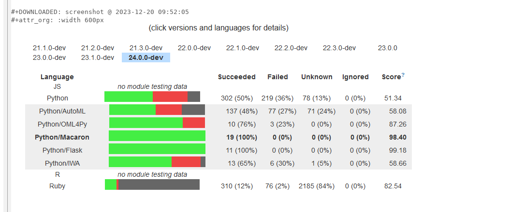
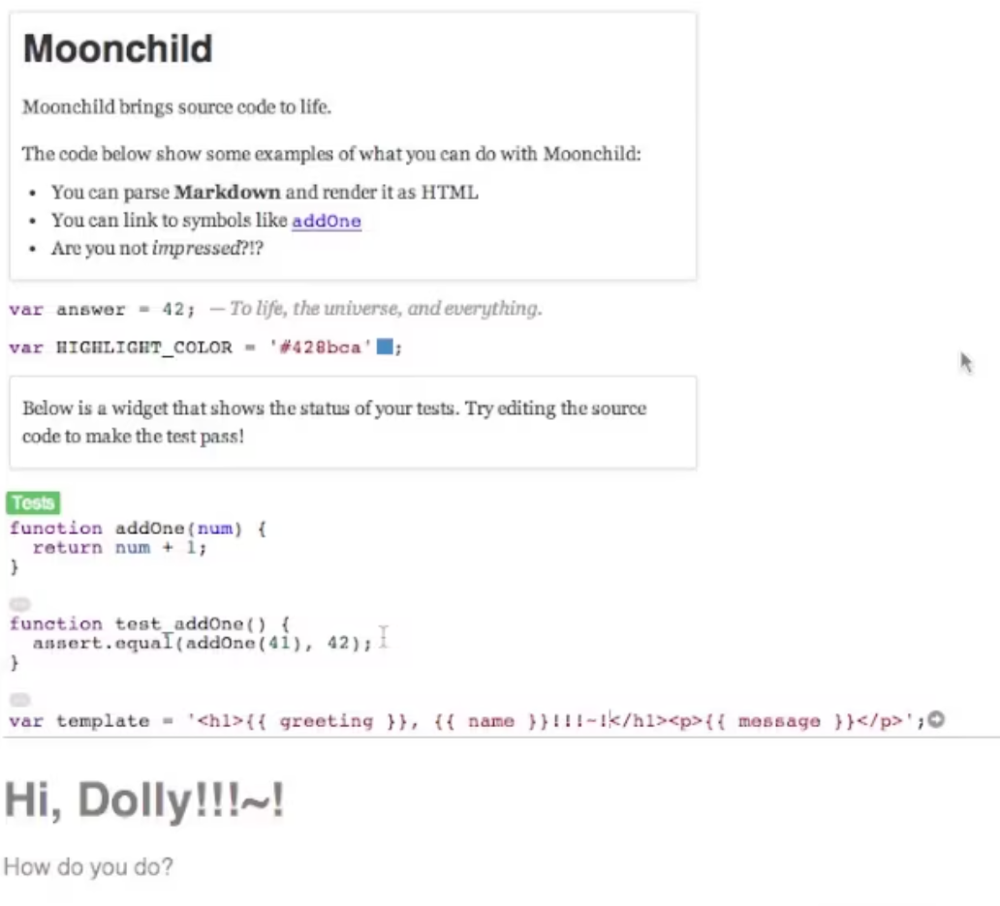

# Related Work

- emacs structural editors with tree sitter

### TouchDevelop 

- [@Tillmann2011TDP]
- structured editing that should feel like text editing
- block UI is optional 

## Intentional Programming

- [@Simonyi1995DCL] C. Simonyi 1995. The Death of Computer Languages the Birth of Intentional Programming
- potentially similar UX vision
- but it is not going back to text, but stays on structural side....

### Emacs org mode

- persists meta data in source code in comments

{width=400}

{width=400}

### Code Mirror 

### Babylonian Programming 

- relies on CodeMirror widgets
- AST parsing 
- persists meta data in source code in comments

### Dubroy 2014, Moonchild

{width=400 style="border:1px solid gray"}

  "Moonchild is a toolkit for experimenting with new kinds of programming interfaces, based on a text editor written in HTML and JavaScript. This is video is a 5-minute highlight reel prepared for the Future Programming Workshop at SPLASH 2014 in Portland, Oregon."

- [full video](https://vimeo.com/106498564), [highlights](https://vimeo.com/106578509)

- concepts:
  - plugins work on AST
  - plugins add "extras" to AST (arbitrary meta data)
  - plugins modify output of other AST
- example
  - constext: javascript
  - color, markdown, linkify, test, types 
- "Open Questions
  - User interaction:
    - What are the common widget patterns?
    - What to do about invalid parses?
    - How to handle stateful widgets?
  - What would a language designed for this be like?" [from highlights video]

- based on CodeMirror annotations and widgets
- [github](https://github.com/harc/moonchild)
- References:
  - Ko, A. J. and Myers, B. A. (2006), Barista: An Implementation Framework for Enabling New Tools, Interaction Techniques and Views in Code Editors, CHI 2006. Project page
  - Baecker, R. and Marcus, A., Design Principles for the Enhanced Presentation of Computer Program Source Text, CHI (1986), 51-58.
  - McDirmid, Sean, Experiments in Code Typography, August 2014. [BLOG](https://web.archive.org/web/20151210183742/http://research.microsoft.com/en-us/projects/liveprogramming/typography.aspx)
  - Eisenberg, A. D. and Kiczales, G., Expressive programs through presentation extension. In Proc. of 6th Int’l Conf. on Aspect-Oriented Software Development (AOSD 2007), pages 73–84. ACM, 2007.
  

